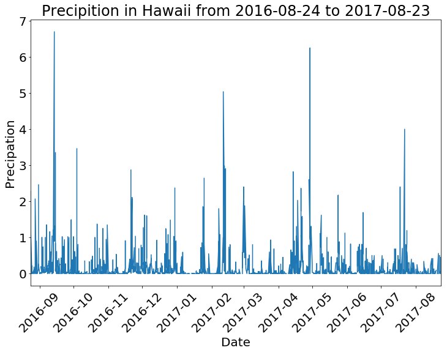
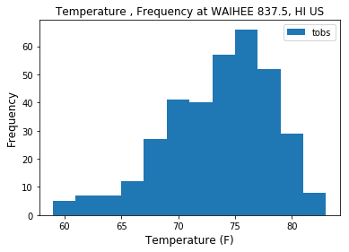
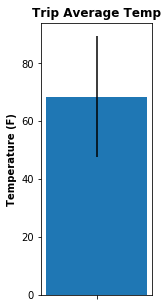
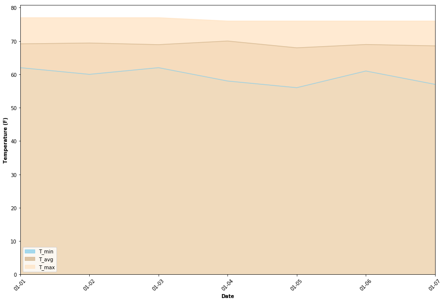

## Climate Analysis and Exploration


```python
# Dependencies
import sqlalchemy
from sqlalchemy.ext.automap import automap_base
from sqlalchemy.orm import Session
from sqlalchemy import create_engine
```


```python
import pandas as pd
import numpy as np
import matplotlib.pyplot as plt
import seaborn
```


```python
engine = create_engine("sqlite:///hawaii.sqlite")
```


```python
Base = automap_base()
Base.prepare(engine, reflect=True)
Base.classes.keys()
```


    ['measurements', 'stations']


```python
# Store tables
Measurements = Base.classes.measurements
Stations = Base.classes.stations
```

+ Design a query to retrieve the last 12 months of precipitation data.
+ Select only the date and prcp values.
+ Load the query results into a Pandas DataFrame and set the index to the date column.
+ Plot the results using the DataFrame plot method.


```python
#create session
session = Session(engine)
```


```python
#inspect measurement table
precip_data = session.query(Measurements).first()
precip_data.__dict__
```


    {'_sa_instance_state': <sqlalchemy.orm.state.InstanceState at 0x1fde64ab550>,
     'date': datetime.date(2010, 1, 1),
     'meas_id': 1,
     'prcp': 0.08,
     'station': 'USC00519397',
     'tobs': 65.0}


```python
#dynamically creates dates from most recent date to a year before
from datetime import datetime
most_current = session.query(Measurements.date).order_by(Measurements.date.desc()).first()
last_date = most_current[0]
year_before = last_date.replace(year = (last_date.year - 1))
year_before = year_before.strftime("%Y-%m-%d")
year_before
```


    '2016-08-23'


```python
#query for precipitation data based on date range from most recent to a year before
twelve_months = session.query(Measurements.date, Measurements.prcp).filter(Measurements.date > year_before)
#create data frame from sql query
twelve_months_prcp = pd.read_sql_query(twelve_months.statement, engine, index_col = 'date')
```


```python
#inspect dataframe
twelve_months_prcp.head()
```


<div>
<style>
    .dataframe thead tr:only-child th {
        text-align: right;
    }

    .dataframe thead th {
        text-align: left;
    }

    .dataframe tbody tr th {
        vertical-align: top;
    }
</style>
<table border="1" class="dataframe">
  <thead>
    <tr style="text-align: right;">
      <th></th>
      <th>prcp</th>
    </tr>
    <tr>
      <th>date</th>
      <th></th>
    </tr>
  </thead>
  <tbody>
    <tr>
      <th>2016-08-24</th>
      <td>0.08</td>
    </tr>
    <tr>
      <th>2016-08-25</th>
      <td>0.08</td>
    </tr>
    <tr>
      <th>2016-08-26</th>
      <td>0.00</td>
    </tr>
    <tr>
      <th>2016-08-27</th>
      <td>0.00</td>
    </tr>
    <tr>
      <th>2016-08-28</th>
      <td>0.01</td>
    </tr>
  </tbody>
</table>
</div>


```python
twelve_months_prcp.plot(figsize = (12, 8), rot = 45, fontsize=20, use_index = True, legend=False)
plt.ylabel('Precipation', fontsize=20)
plt.xlabel('Date', fontsize=20)
plt.title("Precipition in Hawaii from %s to %s" % (twelve_months_prcp.index.min(),twelve_months_prcp.index.max()), fontsize=24)
plt.show()
```





+ Use Pandas to print the summary statistics for the precipitation data.


```python
twelve_months_prcp.describe()
```


<div>
<style>
    .dataframe thead tr:only-child th {
        text-align: right;
    }

    .dataframe thead th {
        text-align: left;
    }

    .dataframe tbody tr th {
        vertical-align: top;
    }
</style>
<table border="1" class="dataframe">
  <thead>
    <tr style="text-align: right;">
      <th></th>
      <th>prcp</th>
    </tr>
  </thead>
  <tbody>
    <tr>
      <th>count</th>
      <td>2015.000000</td>
    </tr>
    <tr>
      <th>mean</th>
      <td>0.176462</td>
    </tr>
    <tr>
      <th>std</th>
      <td>0.460288</td>
    </tr>
    <tr>
      <th>min</th>
      <td>0.000000</td>
    </tr>
    <tr>
      <th>25%</th>
      <td>0.000000</td>
    </tr>
    <tr>
      <th>50%</th>
      <td>0.020000</td>
    </tr>
    <tr>
      <th>75%</th>
      <td>0.130000</td>
    </tr>
    <tr>
      <th>max</th>
      <td>6.700000</td>
    </tr>
  </tbody>
</table>
</div>


## Station Analysis


```python
#inspect station data
station_data = session.query(Stations).first()
station_data.__dict__
```


    {'_sa_instance_state': <sqlalchemy.orm.state.InstanceState at 0x1fde64ec9e8>,
     'elevation': 3.0,
     'id': 1,
     'latitude': 21.2716,
     'longitude': -157.8168,
     'name': 'WAIKIKI 717.2, HI US',
     'station': 'USC00519397'}


```python
#get station count, has been checked with measurement station count
from sqlalchemy import func
num_stations = session.query(Stations.station).group_by(Stations.station).count()
```


```python
num_stations
```


    9


```python
#query tables to get count of daily report, all temp data is complete for each record, so the count
#reflects a count of a station giving temp data, prcp data may or may not have been reported on that date
activity = session.query(Stations.station, Stations.name, Measurements.station, func.count(Measurements.tobs)).filter(Stations.station == Measurements.station).group_by(Measurements.station).order_by(func.count(Measurements.tobs).desc()).all()
```


```python
activity
```


    [('USC00519281', 'WAIHEE 837.5, HI US', 'USC00519281', 2772),
     ('USC00519397', 'WAIKIKI 717.2, HI US', 'USC00519397', 2724),
     ('USC00513117', 'KANEOHE 838.1, HI US', 'USC00513117', 2709),
     ('USC00519523', 'WAIMANALO EXPERIMENTAL FARM, HI US', 'USC00519523', 2669),
     ('USC00516128', 'MANOA LYON ARBO 785.2, HI US', 'USC00516128', 2612),
     ('USC00514830',
      'KUALOA RANCH HEADQUARTERS 886.9, HI US',
      'USC00514830',
      2202),
     ('USC00511918', 'HONOLULU OBSERVATORY 702.2, HI US', 'USC00511918', 1979),
     ('USC00517948', 'PEARL CITY, HI US', 'USC00517948', 1372),
     ('USC00518838', 'UPPER WAHIAWA 874.3, HI US', 'USC00518838', 511)]


Waihee 837.5 has the highest number of observations


```python
#most active station
max_activity = activity[0][0:2]
max_activity
```


    ('USC00519281', 'WAIHEE 837.5, HI US')


```python
# the number of reports from the most active station
temps_maxact = session.query(Measurements.station, Measurements.tobs).filter(Measurements.station == max_activity[0], Measurements.date > year_before).all()
```


```python
len(temps_maxact)
```


    351


```python
#list created from temperature data query from the most active station
temps = [x[1] for x in temps_maxact]
plt.hist(temps, bins=12)
plt.xlabel("Temperature (F)",fontsize=12)
plt.ylabel("Frequency", fontsize=12)
plt.title("Temperature , Frequency at %s" % (max_activity[1]), fontsize=12)
labels = ['tobs']
plt.legend(labels)
plt.show()
```





## Temperature Analysis

+ Write a function called calc_temps that will accept a start date and end date in the format %Y-%m-%d and return the minimum, average, and maximum temperatures for that range of dates.
+ Use the calc_temps function to calculate the min, avg, and max temperatures for your trip using the matching dates from the previous year (i.e. use "2017-01-01" if your trip start date was "2018-01-01")

+ Plot the min, avg, and max temperature from your previous query as a bar chart.

    + Use the average temperature as the bar height.
    + Use the peak-to-peak (tmax-tmin) value as the y error bar (yerr).


```python
def calc_temps(start_date, end_date):
    #create dates 1 year prior
    dates = [start_date, end_date]
    new_dates = []
    for date in dates:
        date_list = date.split("-")
        date_list[0] = str(int(date_list[0]) - 1)
        new_date = "-".join(date_list)
        new_dates.append(new_date)
    print(new_dates) 
    
    #query database for temps from those dates
    temp_values = session.query(Measurements.tobs).filter(Measurements.date >= new_dates[0], Measurements.date <= new_dates[1]).all()
    temp_values_list = [x for (x,) in temp_values]
    avg_temp = np.mean(temp_values_list)
    max_temp = max(temp_values_list)
    min_temp = min(temp_values_list)
    
    # create bar graph
    plt.figure(figsize=(2,5))
    plt.title("Trip Average Temp", weight = "bold")
    plt.ylabel("Temperature (F)",weight = "bold")
    plt.bar(1, avg_temp, yerr = (max_temp - min_temp), tick_label = "")
    plt.show()

```


```python
calc_temps('2018-01-01', '2018-01-14')
```

    ['2017-01-01', '2017-01-14']
    





## Optional Recommended Analysis

#### The following are optional challenge queries. These are highly recommended to attempt, but not required for the homework.

+ Calcualte the rainfall per weather station using the previous year's matching dates.

#### Calculate the daily normals. Normals are the averages for min, avg, and max temperatures.

+ Create a function called daily_normals that will calculate the daily normals for a specific date. This date string will be in the format %m-%d. Be sure to use all historic tobs that match that date string.

+ Create a list of dates for your trip in the format %m-%d. Use the daily_normals function to calculate the normals for each date string and append the results to a list.

+ Load the list of daily normals into a Pandas DataFrame and set the index equal to the date.

+ Use Pandas to plot an area plot (stacked=False) for the daily normals.


```python
#query to return list of temps for each date
def daily_normals(chosen_date):
    temps = session.query(Measurements.tobs).filter(Measurements.date.like('%'+chosen_date)).all()
    obs = [x for (x), in temps]
    return obs
    
start_date = '01-01'
end_date = '01-07'

#function to generate list of dates given any start and end date
def create_date_list(start_date, end_date):
    start_month = start_date.split("-")[0]
    end_month = end_date.split("-")[0]
    
    start_day = int(start_date.split("-")[1])
    end_day = int(end_date.split("-")[1])
    
    if start_month == end_month:
        diff = end_day - start_day
        days = [start_day + x for x in range(0,diff + 1) ]
    
    else:
        diff1 = 31 - start_day
        days1 = [start_day + x for x in range(0,diff1 + 1)]
        days2 = [x for x in range(1, end_day + 1)]
        days = days1 + days2
        
    days_str = [('%s-%s' % (start_month, str(x))) if len(str(x)) == 2 else ('%s-0%s' % (end_month, str(x))) for x in days]
    return days_str

#uses functions above to return dictionary of normals, skips dates for which there is no data (false dates)
def query_results(start, end):
    dates = create_date_list(start, end)
    master_dict = {"Date": [], "T_max": [], "T_min": [], "T_avg": []}
    for date in dates:
        data_list = []
        observations = daily_normals(date)
        if observations != []:
            for temp in observations:
                data_list.append(temp)
            master_dict['Date'].append(date)
            master_dict['T_max'].append(max(data_list))
            master_dict['T_min'].append(min(data_list))
            master_dict['T_avg'].append(round(np.mean(data_list),2))
            master_dict
    return(master_dict)
    
normals_df = pd.DataFrame(query_results('01-01', '01-07')).set_index('Date')
normals_df 
```


<div>
<style>
    .dataframe thead tr:only-child th {
        text-align: right;
    }

    .dataframe thead th {
        text-align: left;
    }

    .dataframe tbody tr th {
        vertical-align: top;
    }
</style>
<table border="1" class="dataframe">
  <thead>
    <tr style="text-align: right;">
      <th></th>
      <th>T_avg</th>
      <th>T_max</th>
      <th>T_min</th>
    </tr>
    <tr>
      <th>Date</th>
      <th></th>
      <th></th>
      <th></th>
    </tr>
  </thead>
  <tbody>
    <tr>
      <th>01-01</th>
      <td>69.15</td>
      <td>77.0</td>
      <td>62.0</td>
    </tr>
    <tr>
      <th>01-02</th>
      <td>69.40</td>
      <td>77.0</td>
      <td>60.0</td>
    </tr>
    <tr>
      <th>01-03</th>
      <td>68.91</td>
      <td>77.0</td>
      <td>62.0</td>
    </tr>
    <tr>
      <th>01-04</th>
      <td>70.00</td>
      <td>76.0</td>
      <td>58.0</td>
    </tr>
    <tr>
      <th>01-05</th>
      <td>67.96</td>
      <td>76.0</td>
      <td>56.0</td>
    </tr>
    <tr>
      <th>01-06</th>
      <td>68.96</td>
      <td>76.0</td>
      <td>61.0</td>
    </tr>
    <tr>
      <th>01-07</th>
      <td>68.54</td>
      <td>76.0</td>
      <td>57.0</td>
    </tr>
  </tbody>
</table>
</div>


```python
normals_df = normals_df[['T_min', 'T_avg', 'T_max']]

normals_df.plot(kind = 'area', stacked = False, alpha = .75, rot = 45, color = ['skyblue', 'tan', 'bisque'], figsize = (15,10), linestyle = '-')
plt.xlabel('Date', weight='bold')
plt.ylabel('Temperature (F)', weight='bold')
plt.legend(frameon = True)
plt.show()
```




